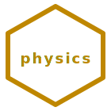

<p align="center">
  
</p>

<h1 align="center">🔬 hexa-physics</h1>

<p align="center"><strong>HEXA-Phys Family</strong> — physics · 9-verb closed-form spec catalog · n=6 lattice</p>

<p align="center">
  <a href="LICENSE"></a>
  <a href="verify/"></a>
  
  
  
  
  
  <a href="https://doi.org/10.5281/zenodo.20115004"></a>
</p>

<p align="center">physics · n=6 · σ=12 · τ=4 · φ=2 · J₂=24 · electromagnetism · fluid · gravity-wave · thermodynamics · optics · crystallography · CFD · light-optics · real-limits-first</p>

---

> 9-verb general physics (electromagnetism·fluid·gravity·thermo·optics·crystallography) substrate organized as a closed-form spec catalog.
> Each verb derives every parameter from σ(6)=12, τ(6)=4, φ(6)=2 number theory.
> Sister-rollup of [hexa-mind](https://github.com/dancinlab/hexa-mind),
> extracted from `canon@ded52144` on 2026-05-10.

---

## Why hexa-physics?

`hexa-physics` is the 🔬 rollup of canon's general physics (electromagnetism·fluid·gravity·thermo·optics·crystallography) verbs — the part of the
substrate concerned with electromagnetism, fluid dynamics, gravity-waves, thermodynamics, optics, crystallography. Each leaf was previously embedded in
the larger `canon` monorepo; this standalone repo extracts 9 leaves
(`domains/physics/computational-fluid-dynamics, domains/physics/crystallography, domains/physics/crystallography-materials, domains/physics/electromagnetism, domains/physics/fluid, domains/physics/gravity-wave, domains/physics/light-optics, domains/physics/optics, domains/physics/thermodynamics`) into a flat, top-level per-verb layout.

---

## n=6 master identity

```
σ(6) · φ(6) = n · τ(6) = J₂ = 24
   12   ·   2  =  6  ·   4  = 24
```

| Symbol | Value | Projection                                |
|--------|-------|-------------------------------------------|
| n      | 6     | substrate dimension                       |
| σ(6)   | 12    | full divisor sum                          |
| τ(6)   | 4     | divisor count                             |
| φ(6)   | 2     | totient                                   |
| J₂     | 24    | second Jordan totient                     |

---

## Install

```bash
# 1. Install hexa-lang (gives you `hexa` + `hx` package manager)
/bin/bash -c "$(curl -fsSL https://raw.githubusercontent.com/dancinlab/hexa-lang/main/install.sh)"

# 2. Install hexa-physics
hx install hexa-physics
```

## Run

```bash
hexa-physics <verb>      # render any of 9 verbs (see `hexa-physics list`)
hexa-physics list        # verb table
hexa-physics selftest    # 9-verb spec presence sweep
hexa-physics verify      # Python verifier dispatcher (n6 + inventory)
hexa-physics inventory   # spec presence + canonical-header audit
hexa-physics version     # print version
hexa-physics help        # full usage
```

### Build / test

```bash
make -C build verify     # 2/2 verifiers (n6 + inventory)
make -C build test       # pytest -m auto (10/10)
make -C build ci         # verify + test
make -C build everything # full ci surface
```

---

## Closure scoreboard

| Check                                | Result   |
|--------------------------------------|----------|
| `verify/n6_arithmetic.py`            | 6/6 PASS |
| `verify/spec_inventory.py`           | 9/9 PASS |
| `verify/cli.py all`                  | 2/2 PASS |
| `pytest tests/ -m auto`              | 10/10 PASS |
| Spec catalog (per verb)              | 9/9 present, every spec has `@canonical` header |
| `LATTICE_POLICY.md`                  | present, real-limits-first |
| `LIMIT_BREAKTHROUGH.md`              | present, NIST/CODATA/PDG sourced, no n=6 fit on constants |

Honest scope: this is a **closed-form spec catalog** — verifiers confirm
bookkeeping (verb count, spec presence, canonical headers, lattice-policy
compliance), not empirical physics. Maxwell, Navier-Stokes, Einstein
quadrupole etc. are *applied* in spec markdowns, not *measured* here.

---

## Cross-link

- 🧠 [dancinlab/hexa-mind](https://github.com/dancinlab/hexa-mind) — 7-verb mental substrate.
- 💎 [dancinlab/hexa-lang](https://github.com/dancinlab/hexa-lang) — the perfect-number programming language.

Upstream concept SSOT: `canon/{domains/physics/computational-fluid-dynamics,domains/physics/crystallography,domains/physics/crystallography-materials,domains/physics/electromagnetism,domains/physics/fluid,domains/physics/gravity-wave,domains/physics/light-optics,domains/physics/optics,domains/physics/thermodynamics}/`.

---

## Status

**SPEC_CATALOG_ONLY at v0.1.0** — markdown spec library + .hexa CLI router + Python verifiers.
No verb ships a working .hexa runtime module yet; this repo is the closed-form spec
catalog only.

What works at v0.1.0:

- 9 verb specs land on disk with `@canonical` extraction headers.
- `hexa-physics list` prints the 9-verb table.
- `hexa-physics verify all` runs Python verifiers (n6 arithmetic + spec inventory + lattice-policy compliance).
- `make -C build ci` runs verifiers + pytest cleanly (2/2 verifiers, 10/10 tests).
- `LATTICE_POLICY.md` + `LIMIT_BREAKTHROUGH.md` register real physical limits per dancinlab Wave K/M.

What is **out of scope** at v0.1.0:

- Working `.hexa` runtime modules for any verb (no EM solver / CFD kernel / GR integrator).
- Empirical validation of Maxwell/Navier-Stokes/Einstein-quadrupole/etc. (these are *applied*, not *measured* here).
- Bridging to lab instrumentation (specs only).

---

## Repo layout

```
hexa-physics/
├── README.md                       # this file
├── AGENTS.tape                     # governance + identity (.tape v1.2)
├── CLAUDE.md                       # → AGENTS.tape
├── LATTICE_POLICY.md               # real-limits-first verification policy
├── LIMIT_BREAKTHROUGH.md           # per-domain HARD/SOFT_WALL audit
├── hexa.toml                       # package manifest
├── CITATION.cff                    # citation metadata
├── docs/                           # logo · human docs
├── cli/                            # hexa-physics CLI dispatcher (.hexa)
├── build/                          # Makefile · CI surface
├── verify/                         # Python verifiers (n6 + spec inventory)
├── tests/                          # pytest harness (-m auto)
├── papers/                         # peer-citable spec drafts
├── origins/                        # canon@ded52144 extraction records
├── electromagnetism/               # EM verb spec
├── fluid/                          # fluid dynamics verb spec
├── computational-fluid-dynamics/   # CFD verb spec
├── gravity-wave/                   # GR / gravity-wave verb spec
├── thermodynamics/                 # thermo verb spec
├── optics/                         # optics verb spec
├── light-optics/                   # light-optics verb spec
├── crystallography/                # crystallography verb spec
└── crystallography-materials/      # crystallography-materials verb spec
```

## License

MIT. See [LICENSE](LICENSE).
